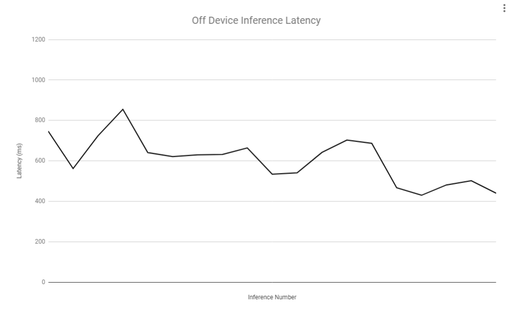
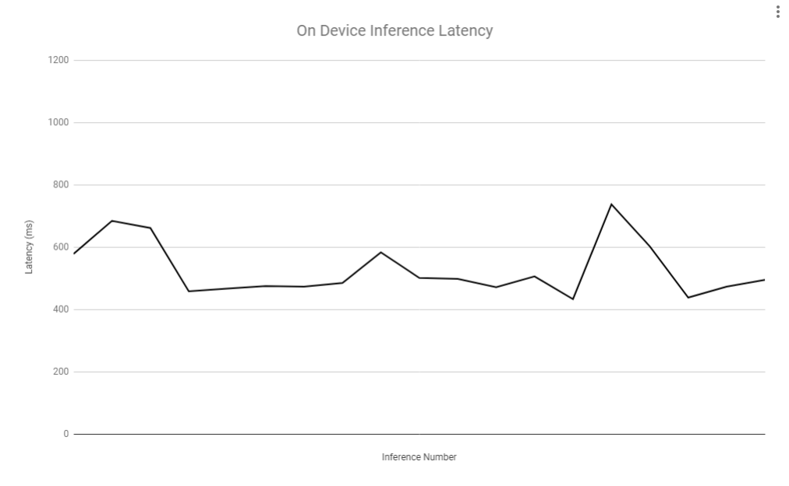
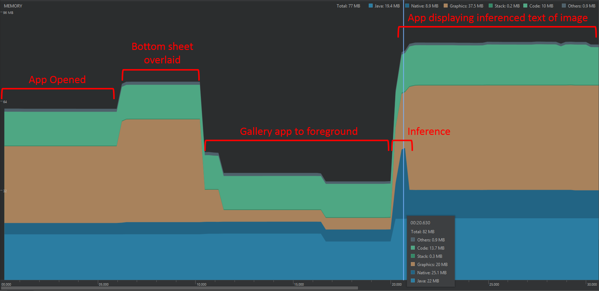
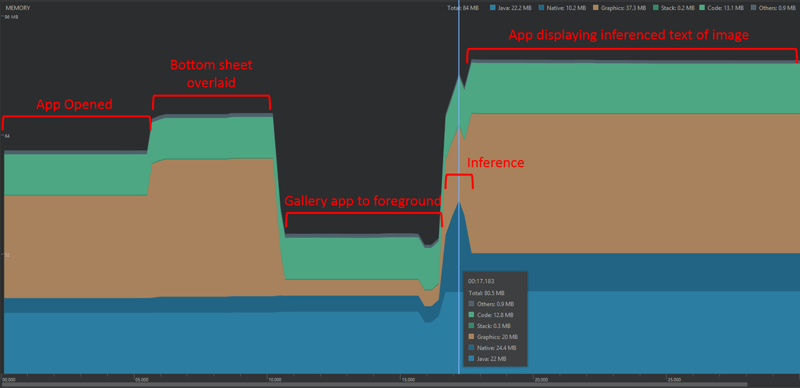
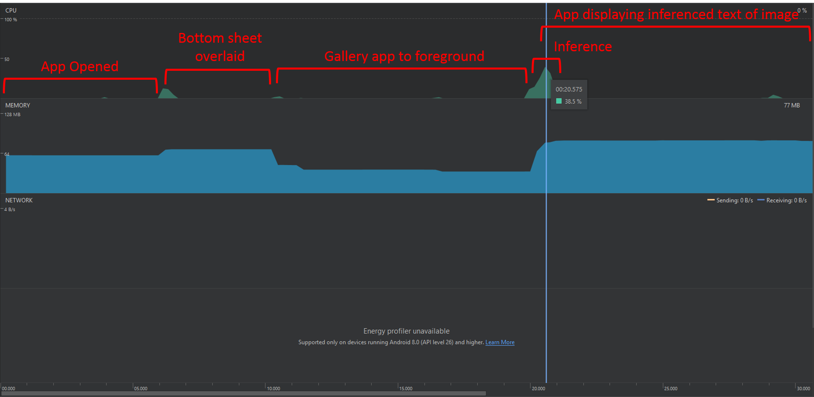
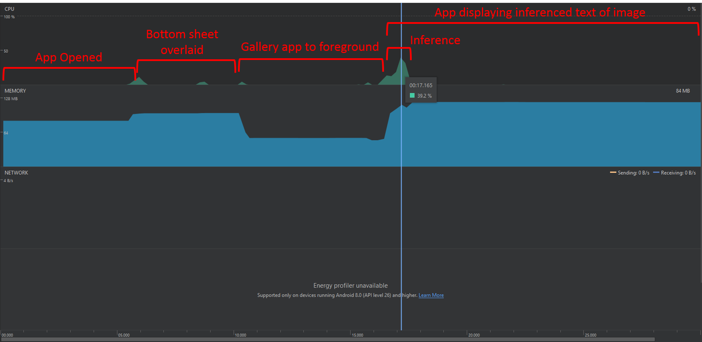
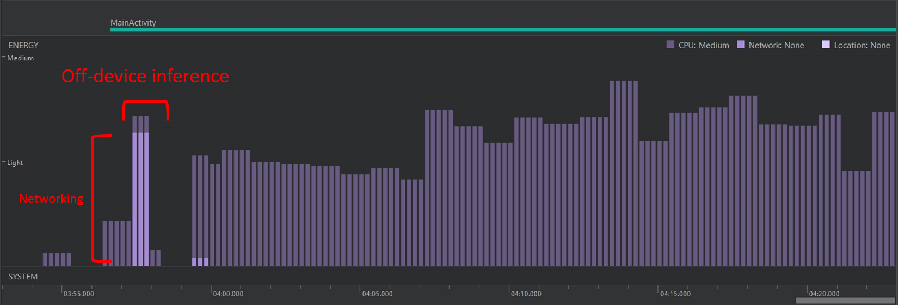
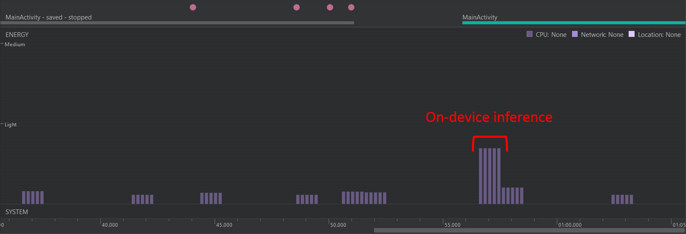

# CS4518 Group Project Performance Measurement Report
Antony Qin, Kyle Savell, Alex Tian, Joseph Yuen

## Performance Metrics Descriptions
### Start up Time
* The amount of time it takes for the app to be fully displayed.
### Inference Time
* The amount of time it takes to do the inference computation.
### Memory Utilization
* The amount of allocated memory as the app is run.
### CPU Utilization
* The amount the CPU dedicates as the app is run.
### Battery Consumption
* The amount of energy consumed as the app is run.

## Methodology
* Start up time was manually recorded over 20 tests by searching for "Displayed wpi.jhyuen.deeplearningproject/.MainActivity" after starting the app on a physical Samsung Galaxy S5.
### Inference Time
* Inference time was calculated by using SystemClock.uptimeMillis() in onPreExecute() and onPostExecute() of the AsyncTask for both off device inference and on device inference. The latency was displayed in a TextView in the app, and then manually recorded for 20 tests on the same image on a physical Samsung Galaxy S5
### Memory Utilization
* Memory usage was determined by viewing the Memory Profiler in Android Studio as the app was run in different stages on a physical Samsung Galaxy S5.
### CPU Utilization
* CPU usage was determined by viewing the CPU Profiler in Android Studio as the app was run in different stages on a physical Samsung Galaxy S5.
### Battery Consumption
* Energy consumption was determined by viewing the Energy Profiler as the app was used in different stages on a physical One Plus 5.

## Quantitative Results
### Start up Time

|Start up Time (ms)|
|:----------------:|
||
||
||
||
||
||
||
||
||
||
||
||
||
||
||
||
||
||
||
||

|Start up Time Average (ms)|
|:------------------------:|

* Summary: Our app started up, on average, in 1s 612ms. This is well under the 5 second cold start as in the lecture so our app does well in not doing too much in its onCreate() method.

### Inference Time

|Off Device Inference (ms)| On Device Inference (ms)|
|:-----------------------:|:-----------------------:|
|           579           |           498           |
|           747           |           578           |
|           562           |           684           |
|           724           |           661           |
|           855           |           458           |
|           641           |           467           |
|           621           |           475           |
|           630           |           473           |
|           632           |           485           |
|           664           |           583           |
|           534           |           501           |
|           541           |           498           |
|           642           |           471           |
|           703           |           506           |
|           687           |           433           |
|           467           |           737           |
|           430           |           602           |
|           481           |           438           |
|           502           |           473           |
|           440           |           495           |

 

|Off Device Inference Average (ms)| On Device Inference Average (ms)|
|:-------------------------------:|:-------------------------------:|
|               604               |               526               |

* Summary: Although there is not a huge difference, off device inference took on average, 78 ms longer than on device inference. So for our application, on device inference is preferred over off device inference.

### Memory Utilization
 
 

### CPU Utilization

* Summary: As you can see from the pictures, off device and on device inference used about the same amount of memory and CPU resources. During off device inference, the app used about ~15mb worth of memory for running Native code while during on device inference, the app used about 13mb worth of memory for running Native code. These values were determined by subtracting the peak Native memory usage underneath the "Inference" timezone displayed in the images from the plateau of Native memory usage underneath the "App displaying inference text of image" timezone.

### Battery Consumption

* Summary

